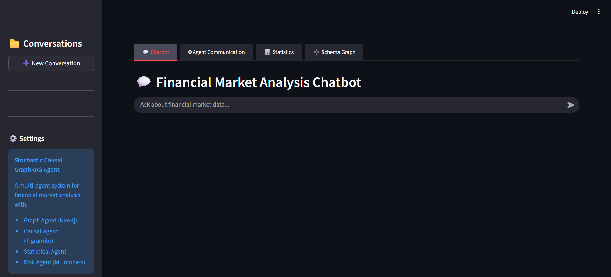
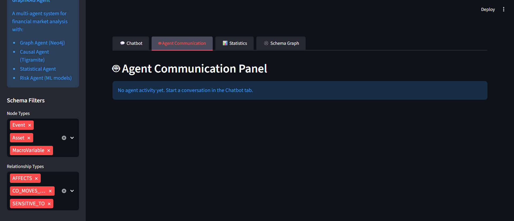
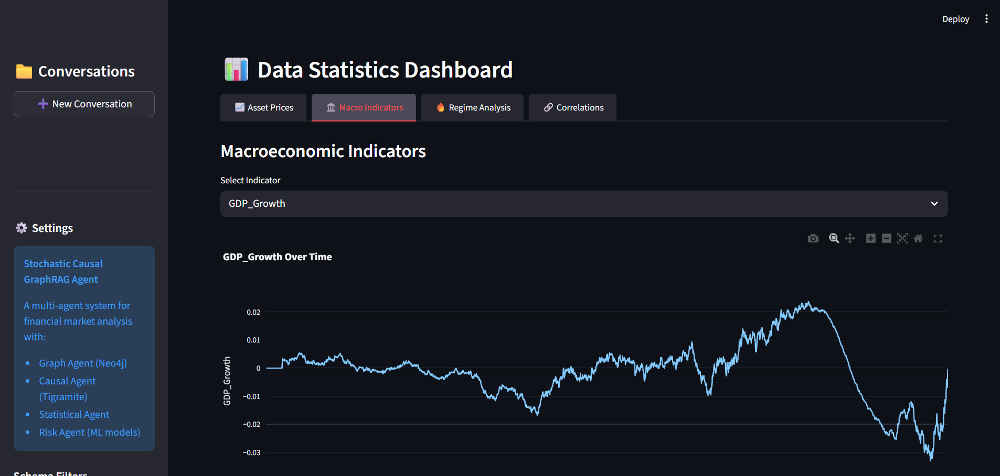
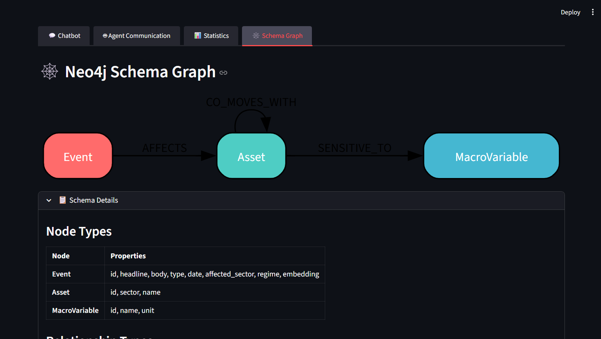

# Stochastic Causal GraphRAG Agent (Financial Markets Edition)

An advanced, locally-hosted Artificial Intelligence ecosystem designed to simulate, analyze, and explain complex financial market dynamics over a 10-year horizon. This system integrates **Stochastic Differential Equations (SDEs)** for realistic data generation, **GraphRAG (Graph Retrieval-Augmented Generation)** for semantic reasoning, and a **Multi-Agent Architecture** orchestrated by local LLMs (Ollama) to answer "Why?" questions with mathematical rigor.

## 🚀 Key Features

*   **Physically-Consistent Simulation**: Generates 10 years of OHLCV and macroeconomic data using SDEs (Merton Jump Diffusion, Vasicek/OU, Lotka-Volterra), not random noise.
*   **Causal Reasoning**: Moves beyond correlation. Uses **Tigramite** (PCMCI) for causal discovery and **EconML** (Causal Forest) for impact estimation.
*   **Hybrid Knowledge Store**: Combines efficient vector search with the structured reasoning of **Neo4j** graph databases.
*   **Local Multi-Agent System**: A team of 5 specialized agents (Orchestrator, Statistical, Graph, Causal, Risk, Report) collaborating to solve complex queries without internet access.
*   **Explainable AI**: Every insight is backed by statistical tests, causal graphs, or cited sources.

## 🧠 System Architecture

The system operates in four main phases:

1.  **The Simulation Engine (`data_generator.py`)**:
    *   Produces realistic market data (Growth, Shock, Recovery cycles).
    *   **jump-diffusion processes** for asset prices.
    *   **Lotka-Volterra equations** for supply chain dynamics.
    *   **Dynamic Beta Engine**: Simulates time-varying correlations driven by market regimes.
    *   **Validation**: Enforces "Stylized Facts" (Fat Tails, Volatility Clustering, Hurst Exponent) to ensure realism.

2.  **The Knowledge Graph**:
    *   **Neo4j** stores entities (Assets, Sectors, Events) and their relationships.
    *   Vector embeddings link unstructured text (FOMC minutes, Earnings reports) to structured market data.

3.  **The Agent Swarm (Ollama Powered)**:
    *   **Orchestrator**: The "Brain" that parses user queries, plans execution, and delegates tasks.
    *   **Statistical Agent**: Performs descriptive statistics, correlation heatmaps, and data validation.
    *   **Graph Agent**: Writes Cypher queries to traverse the knowledge graph.
    *   **Causal Agent**: Runs counterfactual analysis and causal discovery algorithms.
    *   **Risk Agent**: Predicts crash probabilities (XGBoost) and volatility (LSTM).
    *   **Report Agent**: Synthesizes all findings into a professional, human-readable report.

4.  **User Interface**:
    *   **Streamlit** dashboard for interactive chat and data visualization.

## 📸 Screenshots

<div style="display: flex; flex-wrap: wrap; gap: 10px;">
    
    
    
    
</div>

## 🛠️ Technology Stack

*   **Core**: Python 3.11+
*   **LLM Backend**: Ollama (Llama 3, Mistral, etc.)
*   **Database**: Neo4j (Graph + Vector Index)
*   **Data Science**: NumPy, SciPy, Pandas
*   **Causal & ML**: Tigramite, EconML, XGBoost, PyTorch
*   **UI**: Streamlit, Plotly

## 📂 Project Structure

```bash
.
├── agents/                  # Multi-Agent System Implementation
│   ├── orchestrator.py      # Master agent and planning logic
│   ├── statistical_agent.py # Stats & Validation specialist
│   ├── graph_agent.py       # Neo4j specialist
│   ├── causal_agent.py      # Causal inference specialist
│   ├── risk_agent.py        # ML risk models specialist
│   ├── report_agent.py      # Final report synthesizer
│   ├── agent_workflow.py    # Workflow orchestration & error handling
│   ├── base_agent.py        # Abstract base class & LLM wrapper
│   ├── config.py            # Central configuration & Schemas
│   ├── models/              # Pydantic data models (schemas.py)
│   ├── prompts/             # System prompts for all agents
│   └── tools/               # Tool definitions (Graph, Causal, ML, Stats)
├── memory/                  # Long-term Memory & RAG
│   ├── chat_memory.py       # Conversation history management
│   ├── conversation_rag.py  # Retrieval logic
├── model_train/             # Model Training Scripts
│   ├── train_lstm.py        # PyTorch LSTM training
│   ├── train_xgboost.py     # XGBoost training
│   ├── train_causal.py      # Causal model training
│   └── utils.py             # Training utilities
├── data/                    # Generated parquet files and simulation outputs
├── models/                  # Serialized ML models (.joblib, .pth)
├── neo4j/                   # Graph database schema and build scripts
├── conversation/            # Conversation history and RAG
├── outputs/                 # Output PNG (Statistical Plots) files
├── data_generator.py        # The Stochastic Simulation Engine
├── app.py                   # Streamlit Entry Point
├── docker-compose.yml       # Docker Compose file for Neo4j
├── requirements.txt         # Python dependencies
├── .env                     # Environment variables
├── README.md                # This file
├── example_q.txt            # Example questions for system test. 
```

## ⚡ Quick Start

### Prerequisites

*   Python 3.11+
*   [Ollama](https://ollama.com/) installed and running.
*   [Neo4j Desktop](https://neo4j.com/download/) or Docker container running locally.

### Installation

1.  **Clone the repository:**
    ```bash
    git clone https://github.com/your-username/stochastic-causal-graphrag.git
    cd stochastic-causal-graphrag
    ```

2.  **Create a virtual environment:**
    ```bash
    python -m venv venv
    source venv/bin/activate  # On Windows: venv\Scripts\activate
    ```

3.  **Install dependencies:**
    ```bash
    pip install -r requirements.txt
    ```

4.  **Configure Environment:**
    *   Copy `.env.example` to `.env`.
    *   Update Neo4j credentials and Ollama model names in `.env`.

### Running the System

1.  **Generate Data:**
    Run the simulation engine to create the 10-year dataset.
    ```bash
    python data_generator.py
    ```
    *This will create `stochastic_market_data.parquet` in the `data/` folder.*

2.  **Build the Graph:**
    Ingest the generated data into Neo4j.
    ```bash
    python neo4j_build.py
    ```

3.  **Train Risk Models (Optional):**
    Train the LSTM and XGBoost models on the new data.
    ```bash
    python -m model_train.train_risk_models
    ```

4.  **Launch the Agent UI:**
    Start the Streamlit application.
    ```bash
    streamlit run app.py
    ```

## 🧮 Mathematical Foundations & Simulation Engine

The core of this project is a "Living World" simulation engine that generates 10 years of physically consistent market data. Unlike simple random walks, we use Stochastic Differential Equations (SDEs) to model the causal relationships between macroeconomics, supply chains, and asset prices.

### 1. Asset Pricing: Merton Jump Diffusion
Asset prices follow a geometric Brownian motion with Poisson-driven jumps to simulate market shocks (e.g., earnings surprises, geopolitical events).

$$ \frac{dS_t}{S_t} = (\mu - \lambda k)dt + \sigma dW_t + dJ_t $$

*   **$\mu$ (Drift):** Derived dynamically from macro factors (Interest Rate, GDP, Unemployment).
*   **$\sigma$ (Volatility):** Regime-dependent (Higher during "Shock" phases).
*   **$dJ_t$ (Jump):** Poisson process representing sudden price gaps.

### 2. Interest Rates: Extended Vasicek Model
We use a mean-reverting Ornstein-Uhlenbeck process for interest rates, but with **regime-adaptive parameters** and GDP feedback.

$$ dr_t = a(b(t) - r_t)dt + \sigma(t) dW_t + \alpha \cdot \text{GDP}_{growth} $$

*   **$b(t)$:** Long-term target rate (Central bank policy), changes based on regime (e.g., cuts rates in "Shock", hikes in "Overheating").
*   **$a$:** Speed of mean reversion (increases during intervention).

### 3. Supply Chain: Lotka-Volterra (Predator-Prey)
Supply chain dynamics are modeled as a biological system where **Logistics ($L$)** and **Production ($P$)** interact. This generates organic boom-bust cycles in the real economy.

$$ \frac{dL}{dt} = \alpha L - \beta L P \quad (\text{Logistics Capacity}) $$
$$ \frac{dP}{dt} = \delta L P - \gamma P \quad (\text{Industrial Production}) $$

*   **Seasonality:** Incorporates a sinusoidal term $\sin(2\pi t / 63)$ to model quarterly inventory cycles.
*   **Coupling:** A collapse in Logistics ($L$) creates a bottleneck, starving Production ($P$) and triggering inflation/recession.

### 4. Dynamic Correlation: Ornstein-Uhlenbeck Beta
Correlations are NOT static. Identifying as a "Tech" stock implies a variable sensitivity to interest rates ($\beta_{rate}$) that evolves over time.

$$ d\beta_t = \kappa (\theta - \beta_t) dt + \sigma_{\beta} dW_t $$

*   **$\beta_t$:** Sensitivity of an asset to a factor (Rate, GDP, etc.) at time $t$.
*   **$\sigma_{\beta}$:** Increases during "Crisis" regimes, causing correlations to break down (contagion effect).